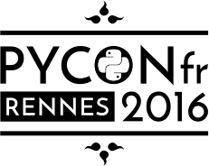

class: y-slide-opening,
background-image: url(img/bgi-opening-min.png)

.triangle-left[]
.triangle-left-bis[]
.logo-min[]
.title-opening[
# Tests Tout-Terrain
## Python édition]
.line[]
---
class: y-slide-info,
background-color: #FFED00

.cadre-blanc[
# \#Big ups
.line[]
.logo-pyconf[]
.logo-yaal-big[]
.twitter[@pierrebousquie | @yaal_fr ]
]

---
class: y-slide-info,
background-color: #FFED00

.cadre-blanc[
# Pierre Bousquié
.line[]

.photo.center[]
.center[Dev @yaal]
.center[Python depuis 5 ans]
.center[Java pendant 5 ans]
.center[C/C++/assembleur/LISP (a la marge)]
.center[et Web (JSCSSHTML2345)]
.twitter[@pierrebousquie | @yaal_fr ]
]

---
class: y-slide-info,
background-color: #FFED00

.cadre-blanc[
# \# Agenda
.line[]
.list[
1. Les tests
2. Les terrains dangereux
3. Les outils]
.twitter[@pierrebousquie | @yaal_fr ]
]

---
class: y-slide-white,

.cadre-jaune[
# Les tests?
.line[]
.quote[
"Ça sert à rien !"

"Cher, compliqué, lent"

"Les méthodes formelles"
]
.twitter[@pierrebousquie | @yaal_fr]
]

---
class: y-slide-white,

.cadre-jaune[
# Les tests?
.line[]
.simple-text[Deux approches]
.black-box[Black box]
.white-box[White box]
.twitter[@pierrebousquie | @yaal_fr]
]

---
class: y-slide-white,

.cadre-jaune[
# Les tests?
.line[]
.simple-text-list[
1. Unitaire (bas niveau)
2. Intégration (haut niveau)
3. Fonctionnel (système (aka ca fonctionne chez moi))
4. Acceptation (recette, humain...)]
.legende.center[Selon le CFTL (www.cftl.fr)]
.twitter[@pierrebousquie | @yaal_fr]
]

---
class: y-slide-white,

.cadre-jaune[
# Les tests...
.line[]

.listing[
### ...de performances
.simple-text-list-small[
  Volume</br>
  Durée</br>
  Concurence</br>
  Temps de récupération]]

.listing[
### ...d'acceptations
.simple-text-list-small[
  Alpha/beta</br>
  Recette</br>
  Usabilité (aveugle, senior...)]]

.listing.listing-third-last[
### ...de sécurité
.simple-text-list-small[
  Accès (page/mémoire/disque)</br>
  Entrées]]

.strong-bottom[Et cette liste n'est pas exhaustive!]

.twitter[@pierrebousquie | @yaal_fr]
]

---
class: y-slide-white,

.cadre-jaune[
# Les tests unitaires
.line[]

```python
def super_additionneur(param1, param2):
    return float(param1) + float(param2)

def test_super_additionneur():
    assert super_additionneur(1, 1) == 2
    assert super_additionneur(3, 5) == 8
    assert super_additionneur(1, -1) == 0
    assert super_additionneur(2.5, 5.) == 7.5
*   assert super_additionneur("vingt", " et un") == "vingt et un"
    assert super_additionneur("1", "1") == 2
    assert super_additionneur("2.5", 5) == 7.5
```
.legende.center[Exemple sametmax.com]

.twitter[@pierrebousquie | @yaal_fr]
]

---
class: y-slide-white,

.cadre-jaune[
# Les tests fonctionnels
.line[]

```python
def super_additionneur(param1, param2):
    return param1 + param2

def test_addition_de_deux_nombres():
    #Arrange
    app = TestApp(application)

    #Act
    response = app.post_json('/super-additionneur', dict(param1=1, param2=2))

    #Assert
    assert response.status == '200 OK'
    assert response.content_type == 'application/json'
    assert response.json == { "result": 3 }

```
.twitter[@pierrebousquie | @yaal_fr]
]
---
class: y-slide-dark,
background-image: url(img/bgi-terrains-min.png)

.bg-darker[
.cadre-jaune[
#### .yellow[Les terrains] </br>dangereux
.line[]
.flex-container[
.yellow-bbox[
Les externes
]
.yellow-bbox[
Les internes
]]
.twitter.twitter-white[@pierrebousquie | @yaal_fr]
]
]

---
class: y-slide-dark,
background-image: url(img/bgi-terrains-min.png)

.bg-darker[
.cadre-jaune[
#### .yellow[Les terrains] </br>dangereux
.line[]
.boxes-line2[
  .yellow-box[
  .icon[]
  BDD
  ]
  .yellow-box[
  .icon[]
  Temps
  ]
  .yellow-box[
  .icom[]

  Graphique
  ]
]

.boxes-line2[
  .yellow-box[
  .icon[]
  Fichiers
  ]
  .yellow-box[
  .icon[]
  Réseaux
  ]
  .yellow-box[
  .icon[]
  Concurence
  ]
]

.twitter.twitter-white[@pierrebousquie | @yaal_fr]
]
]

---
class: y-slide-dark,
background-image: url(img/giphy.gif)

.bg-darker[
.cadre-jaune[
  #### .yellow[BDD] </br> en mémoire !

  .twitter.twitter-white[@pierrebousquie | @yaal_fr]
  ]
]

---
class: y-slide-dark,
background-image: url(img/bgi-temps-min.png)

.bg-darker[
.cadre-jaune[
  # Temps
  .line[]
  .simple-text.simple-text-white.center[
  datetime: monkeypatch

  freezegun
  ]

  .twitter.twitter-white[@pierrebousquie | @yaal_fr]
]
]

---
class: y-slide-dark,
background-image: url(img/bgi-fichiers-min.png)

.bg-darker[
.cadre-jaune[
  # Fichiers
  .line[]
  .simple-text.simple-text-white.center[
    Mock!</br>
    Fake!
  ]
  .twitter.twitter-white[@pierrebousquie | @yaal_fr]
]
]

---
class: y-slide-dark,
background-image: url(img/bgi-reseaux-min.png)

.bg-darker[
.cadre-jaune[
  # Réseaux
  .line[]
  .simple-text.simple-text-white.center[
    Mock!</br>
    Fake!
  ]
  .twitter.twitter-white[@pierrebousquie | @yaal_fr]
]
]

---
class: y-slide-dark,
background-image: url(img/bgi-concurrence-min.png)

.bg-darker[
.cadre-jaune[
  # Concurrence
  .line[]
  .simple-text.simple-text-white.center[
    Test run en parralèle</br>
    Multiple threads!
  ]
  .twitter.twitter-white[@pierrebousquie | @yaal_fr]
]
]

---
class: y-slide-dark,
background-color:#171717

.bg-darker[
.cadre-jaune[
  # Les outils
  .line[]
  .simple-text.simple-text-white.center[
    pytest , nose , unittest</br>
    Mock, Hypothesis, Freezgun</br>
    Tox</br>
    RobotFramework</br>

  ]
  .twitter.twitter-white[@pierrebousquie | @yaal_fr]
]
]
---
class: y-slide-dark,
background-color:#171717

.bg-darker[
.cadre-jaune[
# Tox.ini
.line[]
  ```ini
  [tox]
  envlist = py27, py35
  [testenv]
* deps=
      pytest
      webtest
      werkzeug
  commands=pytest
  ```
  .twitter.twitter-white[@pierrebousquie | @yaal_fr]
]
]

---
class: y-slide-info,
background-color: #FFED00

.cadre-blanc[
# Vous avez tout
.line[]
.big-heading.center[vu]
.twitter[@pierrebousquie | @yaal_fr]
]

---
class: y-slide-info,
background-color: #FFED00

.cadre-blanc[
# \#Questions?
  .logo-min[]
  .twitter[@pierrebousquie | @yaal_fr]
]
---
class: y-slide-info,
background-color: #FFED00

.cadre-blanc[
# \#Mille Mercis!
.list[
- Stéphanie
- La famille
- L'équipe Yaal
- Les orgas
- Les autres présentateurs :)
- Vous public!
]]

